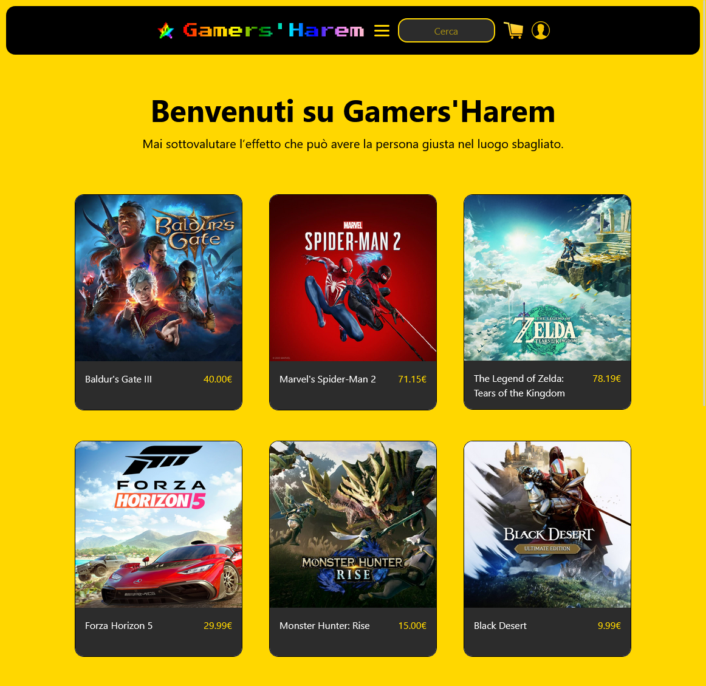
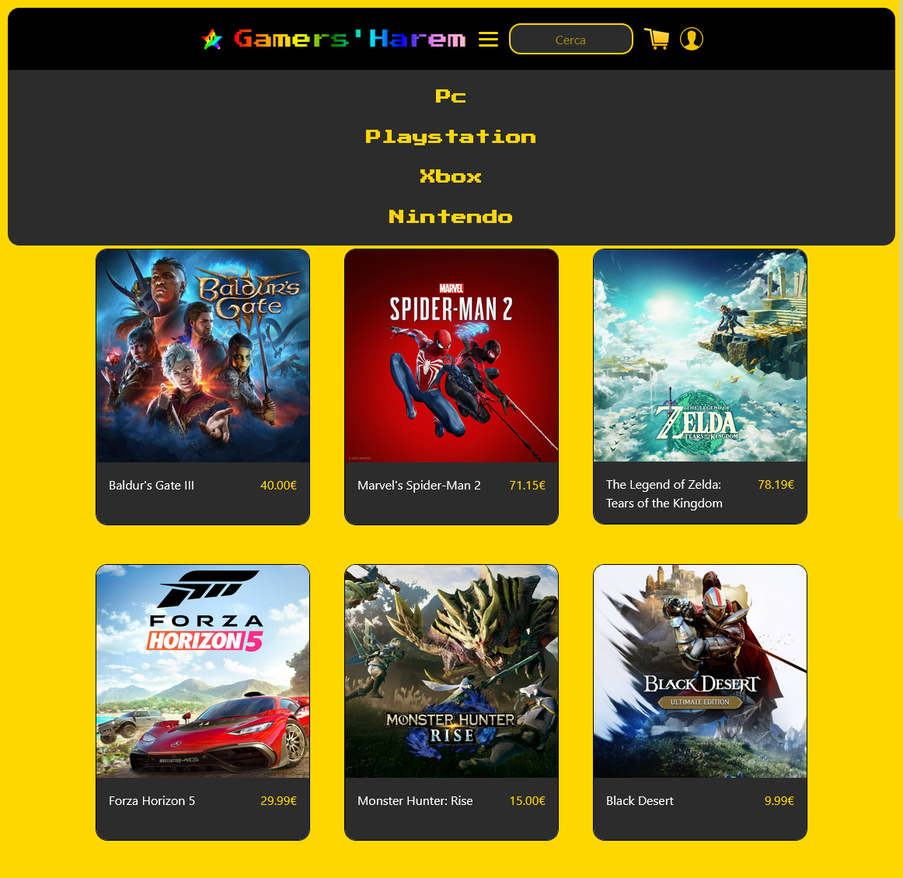
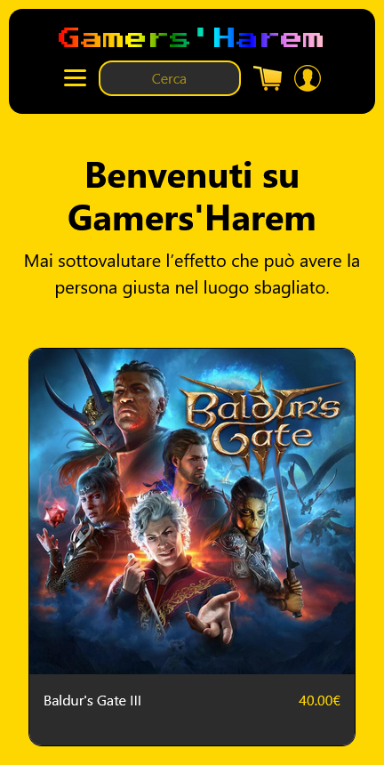
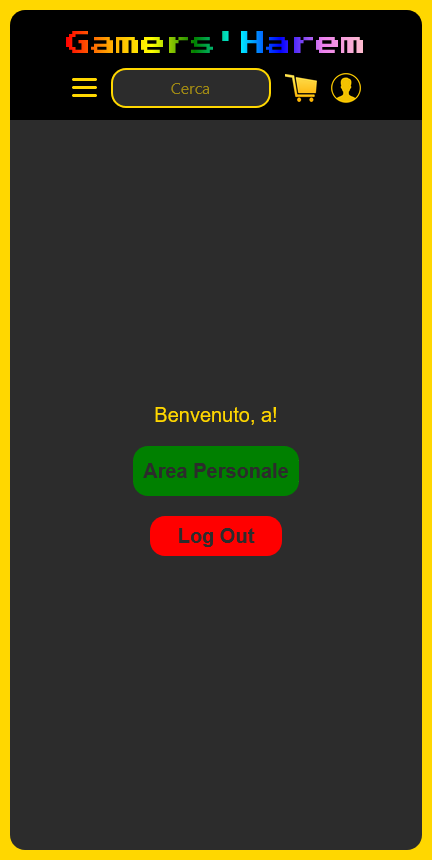

# Gamers'Harem - Marketplace
<a href="https://ssdj3nt.github.io">##Website Static Preview<a>

Gamers'Harem è un sito web dedicato agli appassionati di videogiochi, offrendo una vasta gamma di giochi per diverse piattaforme come PC, PlayStation, Xbox e Nintendo. Gli utenti possono cercare, visualizzare dettagli e acquistare i loro giochi preferiti direttamente dal sito.

Linguaggi e Tecnologie Utilizzati:

    Server Side:
        Flask: Framework web leggero per Python.
        MongoDB: Database NoSQL utilizzato per la gestione degli utenti e delle informazioni sui giochi.
        Python
        Werkzeug
        PyMongo

    Client Side:
        HTML, CSS, JavaScript: Utilizzati per la struttura, lo stile e l'interattività del sito.
        Bootstrap: Framework CSS per la progettazione responsiva.
        Jinja2: Motore di templating per Python, utilizzato con Flask per generare dinamicamente le pagine HTML.

    Integrazione di Pagamenti:
        PayPal API: Integrato per consentire agli utenti di acquistare i giochi in modo sicuro.

    Service Worker:
        Utilizzato per la registrazione di un Service Worker per abilitare la funzionalità di service worker e consentire l'accesso offline alle risorse del sito.

Funzionalità Principali:

    Registrazione e Login:
        Gli utenti possono registrarsi, effettuare il login e gestire il proprio account.

    Ricerca e Navigazione:
        Funzionalità di ricerca per trovare rapidamente i giochi desiderati.
        Navigazione intuitiva tra diverse categorie di giochi.

    Dettagli e Acquisto:
        Pagina dettagliata per ciascun gioco con informazioni complete.
        Possibilità di acquistare tramite PayPal.

    Pagamenti:
       Pagamento sicuro tramite integrazione con il sistema di pagamento PayPal.

Questo repository è stato creato a scopo universitario e utilizza immagini delle copertine di videogiochi per scopi puramente illustrativi. Si prega di leggere attentamente le seguenti linee guida per garantire il rispetto dei diritti d'autore e l'uso appropriato delle risorse.

### Linee Guida:

1. **Scopo Illustrativo:** Le immagini delle copertine dei videogiochi sono utilizzate esclusivamente per descrivere il contenuto del progetto e non vengono sfruttate commercialmente. Il progetto si concentra su scopi accademici e non cerca di appropriarsi dei diritti d'autore associati alle immagini.

2. **Non Implicazione di Affiliazione:** La presenza di immagini di copertine di videogiochi non implica alcuna affiliazione con i giochi specifici o le società di sviluppo. Questo progetto è indipendente e non è associato a nessun marchio o prodotto specifico.

3. **Rispetto dei Diritti d'Autore:** Ci impegniamo a rispettare i diritti d'autore e a rimuovere immediatamente qualsiasi contenuto che violi le leggi sul copyright su richiesta. Se sei il detentore dei diritti di una delle immagini e desideri che vengano rimosse, contattaci e provvederemo prontamente.

4. **Esclusione di Responsabilità:** Non rivendichiamo alcun diritto sulle immagini delle copertine dei videogiochi, che rimangono di proprietà dei rispettivi detentori dei diritti d'autore. L'uso di tali immagini è conforme alle leggi sul copyright e si limita a scopi educativi.

## Licenza

Questo progetto è rilasciato con la licenza Apache per regolamentare l'uso, la modifica e la distribuzione del codice e delle risorse.

## Immagini

  
  
  

