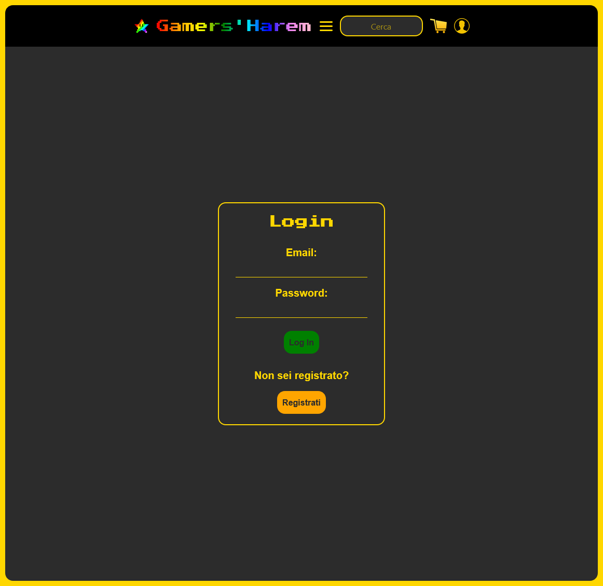

# Gamers'Harem - Marketplace

Gamers'Harem è un sito web dedicato agli appassionati di videogiochi, offrendo una vasta gamma di giochi per diverse piattaforme come PC, PlayStation, Xbox e Nintendo. Gli utenti possono cercare, visualizzare dettagli e acquistare i loro giochi preferiti direttamente dal sito.

Linguaggi e Tecnologie Utilizzati:

    Server Side:
        Flask: Framework web leggero per Python.
        MongoDB: Database NoSQL utilizzato per la gestione degli utenti e delle informazioni sui giochi.
        Python
        Werkzeug
        PyMongo

    Client Side:
        HTML, CSS, JavaScript: Utilizzati per la struttura, lo stile e l'interattività del sito.
        Bootstrap: Framework CSS per la progettazione responsiva.
        Jinja2: Motore di templating per Python, utilizzato con Flask per generare dinamicamente le pagine HTML.

    Integrazione di Pagamenti:
        PayPal API: Integrato per consentire agli utenti di acquistare i giochi in modo sicuro.

    Service Worker:
        Utilizzato per la registrazione di un Service Worker per abilitare la funzionalità di service worker e consentire l'accesso offline alle risorse del sito.

Funzionalità Principali:

    Registrazione e Login:
        Gli utenti possono registrarsi, effettuare il login e gestire il proprio account.

    Ricerca e Navigazione:
        Funzionalità di ricerca per trovare rapidamente i giochi desiderati.
        Navigazione intuitiva tra diverse categorie di giochi.

    Dettagli e Acquisto:
        Pagina dettagliata per ciascun gioco con informazioni complete.
        Possibilità di acquistare tramite PayPal.

    Pagamenti:
       Pagamento sicuro tramite integrazione con il sistema di pagamento PayPal.

## Immagini

  
